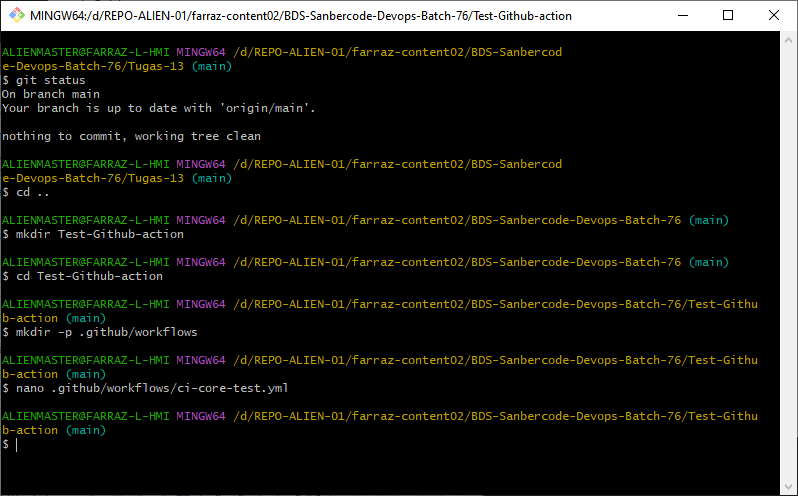
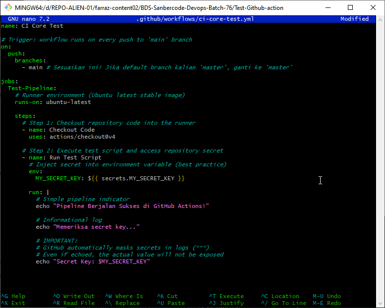
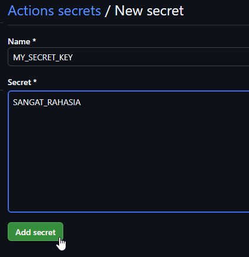
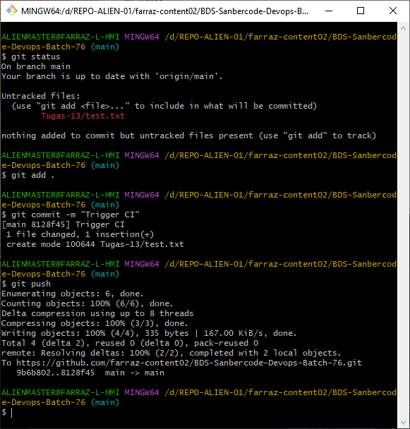
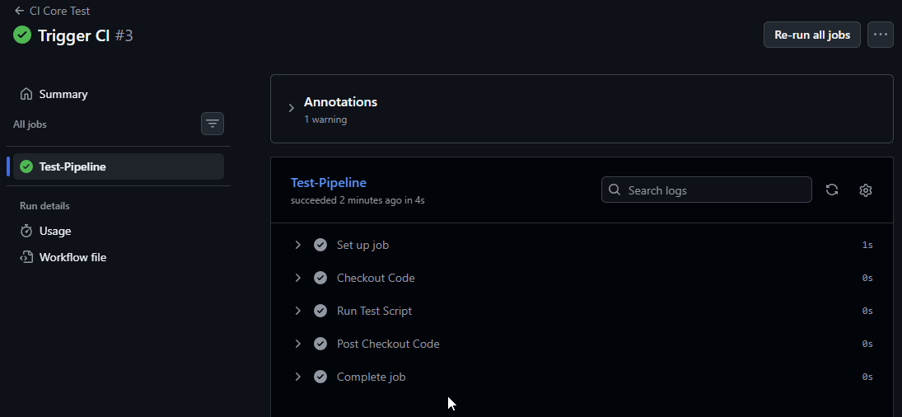
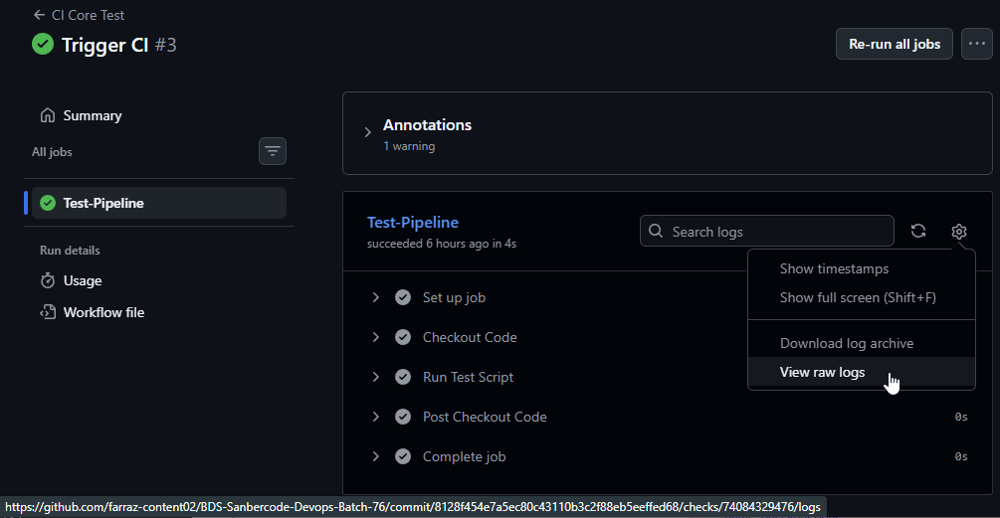
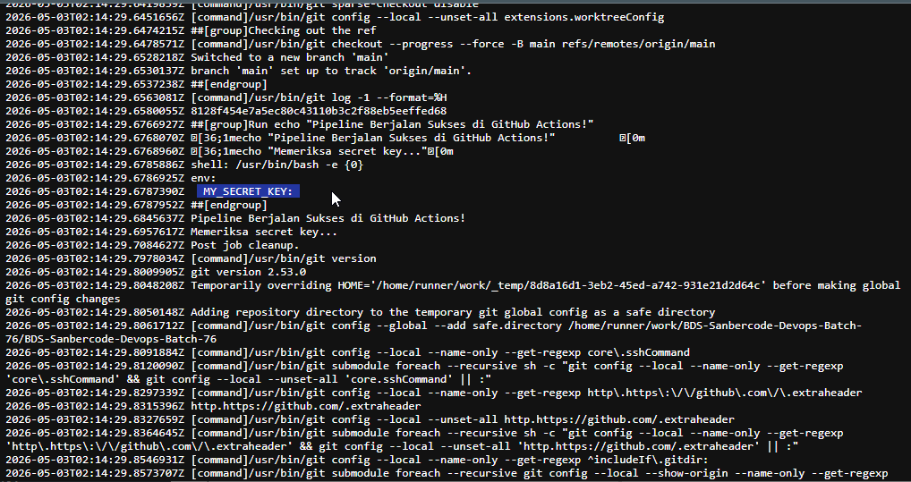

## Bootcamp Digital Skill Sanbercode | DevOps - Batch 76

---

#### Tugas 13: CI/CD Core: Prompting AI untuk Menyusun GitHub Actions Workflow.

### 1️⃣ Add New Project Folder

```bash
$ mkdir Tugas-13

# Then, create separate folder to test-Github Action
$ mkdir Test-Github-action
```

---

### 2️⃣ Step-by-Step Setup

##### Step 1 — Create Workflow File

- ✅ From your local repository:

```bash
# Navigate to your project (pwd)
cd Test-Github-action

# Create GitHub Actions directory
mkdir -p .github/workflows

# Create workflow file (in WSL/Linux)
nano .github/workflows/ci-core-test.yml

# In VSCode, you will be prompted to install new extensions "Github Actions" (by Github)
```

- ✅ Paste the YAML above, then save.

```YAML
name: CI Core Test

# Trigger: workflow runs on every push to 'main' branch
on:
  push:
    branches:
      - main # Sesuaikan ini! Jika default branch kalian 'master', ganti ke 'master'

jobs:
  Test-Pipeline:
    # Runner environment (Ubuntu latest stable image)
    runs-on: ubuntu-latest

    steps:
      # Step 1: Checkout repository code into the runner
      - name: Checkout Code
        uses: actions/checkout@v4

      # Step 2: Execute test script and access repository secret
      - name: Run Test Script
        # Inject secret into environment variable (best practice)
        env:
          MY_SECRET_KEY: ${{ secrets.MY_SECRET_KEY }}

        run: |
          # Simple pipeline indicator
          echo "Pipeline Berjalan Sukses di GitHub Actions!"

          # Informational log
          echo "Memeriksa secret key..."

          # IMPORTANT:
          # GitHub automatically masks secrets in logs (***)
          # Even if echoed, the actual value will not be exposed
          echo "Secret Key: $MY_SECRET_KEY"
```

- ✅ Preview - Create new workflow (YAML)
  
- ✅ Preview - Create new workflow (YAML)
  
  <br>

##### Step 2 — Add Repository Secret (Critical Step)

Secrets are required before running the workflow.
**Steps:**

- [x] 1. Open your repository on GitHub
- [x] 2. Go to:

```text
Settings → (on left side-panel) Secrets and variables → Actions
```

- [x] 3. Click "**New repository secret**"
- [x] 4. Fill:

- Name: MY_SECRET_KEY
- Value: (your actual secret, e.g., API key)

- [x] 5. Click **Add secret**.

- ✅ Preview - xxx
  

<br>

##### Step 3 — Commit and Push Workflow

```bash
git add .github/workflows/ci-core-test.yml
git commit -m "core(ci): Push Tugas-13 > Add CI Core Test workflow"
git push origin main
```

- ✅ Preview - xxx
  

<br>

##### Step 4 — Trigger the Workflow

The workflow will automatically run when you push to main.

You can also trigger it manually by pushing a small change:

```bash
echo "test" >> test.txt
git add .
git commit -m "Trigger CI"
git push origin main
```

- ✅ Preview - Test to trigger the workflow
  

<br>

##### Step 5 — Monitor Execution

- [x] 1. Go to your repository on GitHub
- [x] 2. Click Actions tab
- [x] 3. Select "CI Core Test"
- [x] 4. Click the latest run
- [x] 5. Open Test-Pipeline job

- ✅ Preview - Monitor Execution of CI Pipeline
  

---

### 3️⃣ Verify Output (View Log)

- ✅ Preview - View raw log
  
- ✅ Preview - Verify SECRET_KEY is hidden (masked)
  

---
