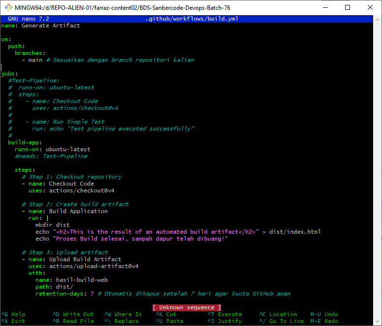
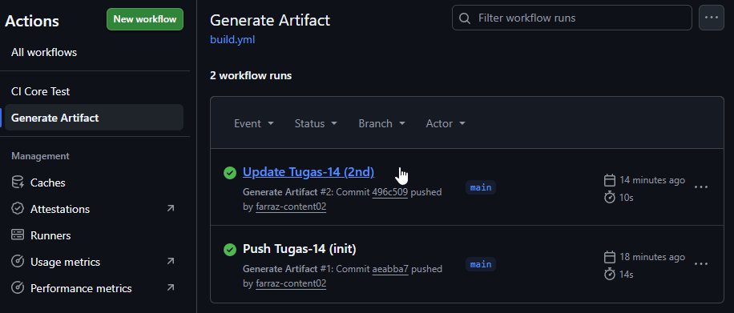
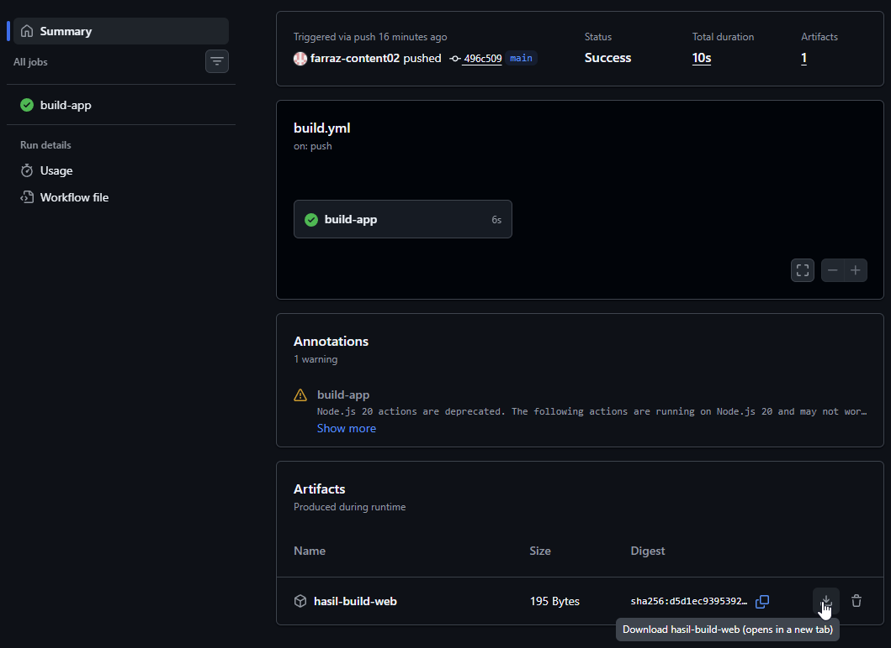
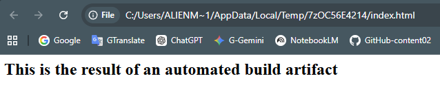

## Bootcamp Digital Skill Sanbercode | DevOps - Batch 76

---

#### Tugas 14: (Automated Build) Triggering Build Artifact di Cloud Runner.

### 1️⃣ Add New Project Folder

```bash
$ mkdir Tugas-14
```

Now, we’re essentially extending our existing workflow into a proper CI stage that produces a build artifact. It systematically:

- [x] Authoring the YAML,
- [x] Committing it, and
- [x] Verifying execution in GitHub Actions.

---

### 2️⃣ Step-by-Step Setup

##### Step 1 — Update / Create Workflow File

- ✅ Use AI to generate GitHub Actions workflow YAML

- **Prompt:**

> _I have already created a GitHub Actions YAML workflow file with jobs named 'Test-Pipeline. Then, i want to create a CI/CD YAML configuration for GitHub Actions.
> Create a job named 'build-app'. Within the job, run a simple Linux command to create a folder named 'dist' and create an 'index.html' file inside it with the text 'This is the result of an automated build artifact'. Then, add a configuration to save the 'dist' folder as a Build Artifact with the name 'hasil-build-web'. Set the artifact's retention period to 7 days.
> So guide me step-by-step in detail from how to create it, setup it,, and run it in Github Actions._

- ✅ From your local repository:

```bash
# Navigate to your project (pwd - main dir)
$ cd BDS-Sanbercode-Devops-Batch-76

# Create GitHub Actions directory
$ mkdir -p .github/workflows

# Create workflow file (in WSL/Linux): main.yml
$ nano .github/workflows/build.yml

# In VSCode, you will be prompted to install new extensions "Github Actions" (by Github)
```

##### Step 2 — Full YAML Configuration (CI + Build Artifact)

✍️ Refine (combine with) your previous workflow (`main.yml`) like this:

- ✅ Paste the YAML from AI above, then Save.

```YAML
name: CI Core Test

on:
  push:
    branches:
      - main

jobs:
  Test-Pipeline:
    runs-on: ubuntu-latest
    steps:
      - name: Checkout Code
        uses: actions/checkout@v4

      - name: Run Simple Test
        run: echo "Test pipeline executed successfully"

  build-app:
    runs-on: ubuntu-latest
    needs: Test-Pipeline

    steps:
      # Step 1: Checkout repository
      - name: Checkout Code
        uses: actions/checkout@v4

      # Step 2: Create build artifact
      - name: Build Application
        run: |
          mkdir dist
          echo "This is the result of an automated build artifact" > dist/index.html

      # Step 3: Upload artifact
      - name: Upload Build Artifact
        uses: actions/upload-artifact@v4
        with:
          name: hasil-build-web
          path: dist
          retention-days: 7
```

✍️ Or, create new YAML file (`build.yml`) like this:

```YAML
name: Generate Artifact

on:
  push:
    branches:
      - main # Sesuaikan dengan branch repositori kalian

jobs:
  build-app:
    runs-on: ubuntu-latest
    steps:
      - name: Checkout Code
        uses: actions/checkout@v4
      # Simulasi Proses Build (Di dunia nyata ini berisi perintah spt npm run build)
      - name: Jalankan Proses Build
        run: |
          echo "Memulai proses kompilasi di mesin Cloud..."
          mkdir dist
          echo "<h1>Sukses! Ini adalah hasil build (Artifact) dari mesin CI/CD</h1>" > dist/index.html
          echo "Proses Build selesai, sampah dapur telah dibuang!"

      # Menyimpan folder 'dist' menjadi paket Artifact
      - name: Upload Build Artifact
        uses: actions/upload-artifact@v4
        with:
          name: hasil-build-web
          path: dist/
          retention-days: 7 # Otomatis dihapus setelah 7 hari agar kuota GitHub aman
```

- ✅ Preview - Create new workflow (YAML)
  

  <br>

##### Step 3 — Explanation (Important for DevOps Understanding)

**Job**: `build-app`

- `runs-on: ubuntu-latest` → uses Linux runner
- `needs: Test-Pipeline` → ensures **CI test** runs first (pipeline sequencing)

**Build Step**

```bash
$ mkdir dist
$ echo "This is the result of an automated build artifact" > dist/index.html
```

**Artifact Upload**

```YAML
uses: actions/upload-artifact@v4
```

- [x] Stores build output in GitHub
- [x] `name: hasil-build-web` → artifact label
- [x] `path: dist` → directory to archive
- [x] `retention-days: 7` → auto-delete after 7 days

- ✅ Preview - xxx
  

<br>

##### Step 4 — Commit & Push Workflow

```bash
$ git add .github/workflows/build.yml
$ git commit -m "Add build-app job with artifact upload"
$ git push origin main
```

<br>

##### Step 5 — Run the Workflow

Once pushed:

1. Go to your repository on GitHub
2. Click Actions tab
3. Select workflow: "CI Core Test"
4. Click latest run

You will see:

- Job 1: Test-Pipeline ✅
- Job 2: build-app ✅

<br>

- ✅ Preview - Test to trigger the workflow
  

---

### 3️⃣ Verify Artifact

Inside the workflow run:

1. Scroll down to Artifacts
2. You will see:
   - [x] `hasil-build-web`

3. Download it → extract → confirm:

```text
dist/index.html
```

<br>

- ✅ Preview - download artifact
  
- ✅ Preview - Verify artifact → Automation Build is success
  

---

### 4️⃣ Expected Pipeline Flow

```text
Push → Trigger Workflow
        ↓
   Test-Pipeline (CI)
        ↓
   build-app (Build)
        ↓
   Artifact Stored (7 days)
```
